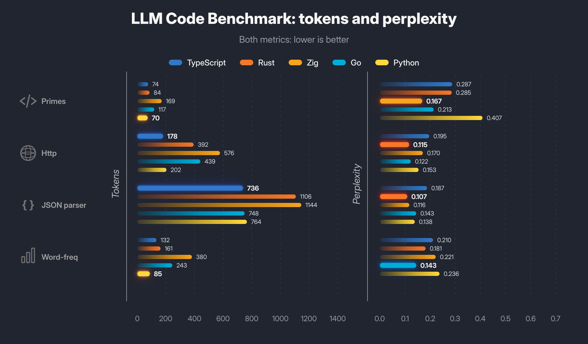

# Cross-language LLM code benchmark: tokens and perplexity

A mini-benchmark scoring programming languages on two LLM-related metrics, both lower-is-better:

- **Tokens** - how much text an idiomatic implementation takes. Maps to API billing and decoding latency.
- **Perplexity bits** - how surprising the code is to a small code LM. Maps to first-shot correctness and retry cost.

Snapshot covers Rust, TypeScript, Zig, Go and Python. Adding a language is one registry entry.



## Versions used for the snapshot

- Rust stable 1.95.0
- TypeScript 7.0 Beta via `@typescript/native-preview@beta` / `tsgo`
- Zig 0.16.0
- Go 1.26
- Python 3.12+ (FastAPI 0.115, uvicorn 0.32 for the http-rest example)
- Counter: `tiktoken==0.13.0`
- Tokenizer: `o200k_base`

## Toolchains

- **Rust:** <https://www.rust-lang.org/tools/install>
- **Zig:** <https://ziglang.org/learn/getting-started>
- **Go:** <https://go.dev/doc/install>
- **TypeScript example:** `cd typescript && npm install`
- **Python example runtime (FastAPI for http-rest):** `pip3 install -r python/requirements.txt`

## Metrics

Two complementary metrics, both run over the same reference implementations.

**Token count** (`scripts/count_tokens.py`): length of each implementation under the `o200k_base` tokenizer. Tokenizer-only, language-agnostic, no model weights needed. *Impact:* direct dollar cost on token-billed APIs (each input + output token is line-item billable) and decoding latency (autoregressive generation costs roughly one forward pass per token, so wall-clock time scales linearly).

**Perplexity bits** (`scripts/score_perplexity.py`, see "Perplexity baseline" below): how many bits a small code LM needs to generate each implementation given a per-task prompt. The prompt is held fixed and only the code tokens are scored:

$$\text{total bits} = \sum_{i=1}^{N} -\log_2 p(t_i \mid t_{\lt i})$$

where $t_1, \ldots, t_N$ are the code tokens and the conditioning $t_{\lt i}$ includes the prompt tokens. For cross-task aggregation we report bits per UTF-8 byte (the Code Llama / Qwen2.5-Coder convention), with perplexity derived from the average:

$$\text{bpb} = \frac{\text{total bits}}{\text{byte len}} \qquad \text{PPL} = 2^{\text{total bits}/N}$$

*Impact:* lower bits mean the LM is more confident in this code shape, so first-shot correctness rises and retry / regeneration cost falls. Does not directly change per-call billing the way token count does, but compounds with it: high perplexity inflates the *effective* token budget because more attempts are needed before useful output appears.

The two metrics can disagree: a verbose-but-predictable implementation may cost more tokens but fewer bits, and vice versa. Token count is the visible price tag; perplexity is the implicit quality / first-shot-correctness signal.

## Baseline table

Token counts depend on the `tiktoken` version and selected encoding; recalculate locally for exact numbers.

| Example | Rust tokens | TypeScript tokens | Zig tokens | Go tokens | Python tokens | Winner |
|---|---:|---:|---:|---:|---:|---|
| find-prime-numbers | 84 | 74 | 169 | 117 | 70 | Python |
| http-rest | 392 | 178 | 576 | 439 | 202 | TypeScript |
| json-parser | 1106 | 736 | 1144 | 748 | 764 | TypeScript |
| word-frequency | 161 | 132 | 380 | 243 | 85 | Python |
| **Total** | **1743** | **1120** | **2269** | **1547** | **1121** | **TypeScript** |

Relative to TypeScript (the current overall winner):

| Language | Total tokens | Ratio vs TypeScript |
|---|---:|---:|
| TypeScript | 1120 | 1.00x |
| Python | 1121 | 1.00x |
| Go | 1547 | 1.38x |
| Rust | 1743 | 1.56x |
| Zig | 2269 | 2.03x |

## Perplexity baseline table

Bits and bits-per-byte under base Qwen2.5-Coder-3B Q5_K_M. Lower = the LM is more confident in the code shape (fewer expected retries / regenerations). Per-row Winner is by smallest `total_bits`. Two aggregate rows with different winners follow:

- `Sum total_bits` - total bits to generate all four reference impls. Winner = lang with smallest absolute generation cost (closer to dollar/latency cost per task).
- `Aggregate bpb` - byte-weighted bits per UTF-8 byte. Winner = lang whose code shape is most intrinsically predictable per byte (canonical Code Llama / Qwen2.5-Coder metric; favors compact-and-typed code over verbose-and-easy).

| Example | Rust bits | Rust bpb | TS bits | TS bpb | Zig bits | Zig bpb | Go bits | Go bpb | Py bits | Py bpb | Winner |
|---|---:|---:|---:|---:|---:|---:|---:|---:|---:|---:|---|
| find-prime-numbers | 65.0 | 0.285 | 67.5 | 0.287 | 95.1 | 0.167 | 70.5 | 0.213 | 82.3 | 0.407 | Rust |
| http-rest | 164.6 | 0.115 | 121.4 | 0.195 | 346.1 | 0.170 | 176.3 | 0.122 | 110.0 | 0.153 | Python |
| json-parser | 450.1 | 0.107 | 478.0 | 0.187 | 529.3 | 0.116 | 310.9 | 0.143 | 436.8 | 0.138 | Go |
| word-frequency | 113.7 | 0.181 | 97.9 | 0.210 | 314.1 | 0.221 | 117.0 | 0.143 | 81.5 | 0.236 | Python |
| **Sum total_bits** | 793.4 | - | 764.6 | - | 1284.6 | - | **674.6** | - | 710.6 | - | **Go** |
| **Aggregate bpb** | 793.4 | **0.122** | 764.6 | **0.197** | 1284.6 | **0.150** | 674.6 | **0.142** | 710.6 | **0.160** | **Rust** |

The two aggregates **disagree** because Rust source is bytewise longer (~6500 UTF-8 bytes total) but each byte carries less surprise to the LM, while Go is more compact (~4760 bytes) so its per-byte surprise is higher. Pick whichever metric matches what you optimize for - **Go** if you measure "bits to generate the next task end-to-end", **Rust** if you measure "intrinsic predictability of code style per byte".

Relative to the Sum-total_bits winner:

| Language | Sum total_bits | Ratio vs Go | Aggregate bpb | Ratio vs Rust |
|---|---:|---:|---:|---:|
| Go | 674.6 | 1.00x | 0.142 | 1.16x |
| Python | 710.6 | 1.05x | 0.160 | 1.31x |
| TypeScript | 764.6 | 1.13x | 0.197 | 1.61x |
| Rust | 793.4 | 1.18x | 0.122 | 1.00x |
| Zig | 1284.6 | 1.90x | 0.150 | 1.23x |

The token leaderboard (TypeScript first, Python a hair behind) and the perplexity-bits leaderboard (Go first) and the perplexity-bpb leaderboard (Rust first) all rank differently - they answer slightly different cost questions. Tokens map to API billing, sum-bits maps to LLM-generation cost per task, bpb measures per-byte style predictability.

## Methodology

Both metrics run over the same reference implementations; see Metrics above for the math. The code itself aims to be:

- compact, but still readable;
- idiomatic enough for each language;
- typed in a way a human would likely write;
- free of explicit return type annotations where the language reasonably allows it;
- comparable by task, not by exact AST structure.

The four examples are:

1. `find-prime-numbers` - a basic numeric loop and collection.
2. `http-rest` - a simple REST API with list/get/create users.
3. `json-parser` - a tiny handwritten JSON parser, with no non-standard parser libraries.
4. `word-frequency` - a small text pipeline with grouping, sorting and top-k output.

## Run token counting

```bash
pip3 install -r requirements.txt
python3 scripts/count_tokens.py --encoding o200k_base
```

Writes `results/current.{md,json,csv}` and prints the markdown table to stdout.

## Perplexity baseline

`scripts/score_perplexity.py` scores each reference implementation under a small local code LM and reports `total_bits` per row and `bpb` for cross-task aggregation. The Metrics section above defines the formulas. `--model PATH` is required; the canonical baseline scorer is base Qwen2.5-Coder-3B Q5_K_M (see below).

The canonical scorer is the **base** Qwen2.5-Coder-3B, NOT the `-Instruct` variant. Instruct-tuned models bias probability mass toward markdown code fences and explanatory prose, inflating bits on bare code.

### Install

The perplexity dependency is in the same `requirements.txt` as `tiktoken`, so the install line above already covers it. For a meaningful CPU speedup on long-running scoring, rebuild llama-cpp-python with a tuned BLAS backend for your platform:

```bash
# Apple Silicon (GPU via Metal, 5-10x faster)
CMAKE_ARGS="-DGGML_METAL=on" pip3 install --force-reinstall --no-binary llama-cpp-python llama-cpp-python

# Intel/AMD Mac (Apple Accelerate BLAS, 30-50% faster matmul)
CMAKE_ARGS="-DGGML_BLAS=on -DGGML_BLAS_VENDOR=Apple" pip3 install --force-reinstall --no-binary llama-cpp-python llama-cpp-python

# Linux (OpenBLAS, similar matmul speedup; install libopenblas-dev/openblas-devel first)
CMAKE_ARGS="-DGGML_BLAS=on -DGGML_BLAS_VENDOR=OpenBLAS" pip3 install --force-reinstall --no-binary llama-cpp-python llama-cpp-python
```

On Linux the pip install often compiles from source and needs OpenMP development headers:

```bash
sudo apt install libomp-dev      # Debian/Ubuntu
sudo dnf install libomp-devel    # Fedora/RHEL
```

### Download the canonical scorer model

```bash
scripts/download_scorer_model.sh
```

Default downloads Qwen2.5-Coder-3B Q5_K_M (~2.1 GB, the **base** variant) to `models/` (gitignored). Pass a preset (e.g. `qwen-coder-7b`, `qwen-coder-0.5b`) or a full HuggingFace spec to override; run `scripts/download_scorer_model.sh --help` for the list. Any GGUF works via `--model PATH`, but the baseline snapshot was scored against this specific quant.

### Run

```bash
python3 scripts/score_perplexity.py --model models/qwen2.5-coder-3b-q5_k_m.gguf
```

One invocation writes `results/current_perplexity.{md,json,csv}` and prints the markdown table to stdout (mirrors `count_tokens.py`). The committed snapshot lives at `results/baseline_perplexity.{md,json}` (rendered numbers are in the "Perplexity baseline table" section above).

## Render the chart

The header image (`media/chart.png`) is generated from `results/current.json` + `results/current_perplexity.json` by a small Node script that drives `node-canvas`:

```bash
# one-time: system deps for node-canvas (Cairo + Pango + libs)
brew install pkg-config cairo pango libpng jpeg giflib librsvg     # macOS
sudo apt install libcairo2-dev libpango1.0-dev libjpeg-dev libgif-dev librsvg2-dev  # Debian/Ubuntu

cd media
npm install
node draw-chart.mjs
```

Writes `media/chart.png` next to the script. Re-run after `count_tokens.py` / `score_perplexity.py` to refresh the image.
